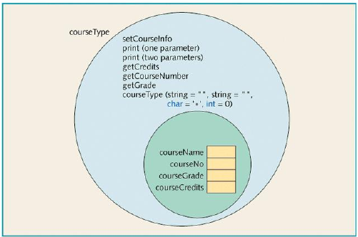

# İKİNCİ ZORUNLU ÖDEV

C++ programlama dili kullanarak sınıf, kalıtım (inheritance) ve birleşim (composition) kullanımı
hakkında pratiğe dayalı bir deneyim sunmayı amaçlamaktadır. Ödevle ilgili önemli bilgiler
aşağıda verilmektedir.

## ÖDEV KONUSU: SINIF RAPORU

Üniversitenizde dönem ortası yaklaşmaktadır. Kayıt ofisi,
öğrencilerin notları kaydedilir kaydedilmez not raporlarını
hazırlamak istemektedir. Ancak kayıtlı öğrencilerden bazıları
henüz harçlarını ödememişlerdir.

1. Eğer bir öğrenci harç ücretini ödemişse, notlar, not ortalaması
   (GPA) ile not raporunda gösterilir.
2. Öğrenci okul ücretini ödememişse notlar basılmaz. Bu öğrenciler
    için not raporunda, notların öğrenim ücretinin ödenmemesi
    nedeniyle bekletildiğini belirten bir mesaj yer alır. Not
    raporunda ayrıca fatura tutarı da gösterilir.

**> Veriler bir dosyada veriler aşağıdaki biçimde saklanır**:

```text
15000 345
studentName studentID isTuitionPaid numberOfCourses
courseName courseNumber creditHours grade
courseName courseNumber creditHours grade
........
studentName studentID isTuitionPaid numberOfCourses
courseName courseNumber creditHours grade
courseName courseNumber creditHours grade
.........
```

> İlk satır kayıtlı öğrenci sayısını ve kredi saati başına öğrenim ücretini göstermektedir.
> Daha sonra öğrenci verileri verilmektedir.

---

**> Örnek bir giriş dosyası aşağıda verilmektedir**:

```text
3 345
Lisa Miller 890238 Y 4
Mathematics MTH345 4 A
Physics PHY357 3 B
ComputerSci CSC478 3 B
History HIS356 3 A
......
```

**> Her öğrenci için beklenen çıkış dosyası aşağıdaki formda olmalıdır**:

```text
Student Name: Lisa Miller
Student ID: 890238
Number of courses enrolled: 4
Course No Course Name Credits Grade
CSC478 ComputerSci 3 B
HIS356 History 3 A
MTH345 Mathematics 4 A
PHY357 Physics 3 B
Total number of credits: 13
Mid-Semester GPA: 3.54
```

**Girdi**: Yukarıda verilen formda veri içeren bir dosyadır. Tartışmanın geri kalanında kolay referans
için, girdi dosyasının adının `input.txt` olduğunu varsayınız.

**Çıktı**: Yukarıda verilen formda çıktı içeren bir dosya.

## Problem Analizi ve Algoritma Tasarımı

Programda kullanılması gereken iki ana bileşen öğrenci ve kurstur.

### Kurs

Bir dersin temel özellikleri **ders adı, ders numarası ve kredi saati**
sayısıdır. Öğrencinin aldığı not gerçekte bir kursun özelliği
olmamasına rağmen, programı basitleştirmek için bu bileşen
öğrencinin notunu da içerir.

**Kurs türündeki bir nesne üzerindeki işlemler şunlardır**:

1. Kurs bilgilerinin düzenlenmesi.
2. Kurs bilgilerinin yazdırılması.
3. Kredi saatlerinin gösterilmesi.
4. Kurs numarasının gösterilmesi.
5. Notun gösterilmesi.



> Figure 14-12 `class courseType`

### Öğrenci

Bir öğrencinin **temel özellikleri öğrenci adı, öğrenci kimliği, kayıtlı olduğu ders sayısı, kayıtlı olduğu dersler ve her ders için nottur.**

Her öğrenci harç ödemek zorunda olduğundan, öğrencinin harç ödeyip ödemediğini gösteren bir üyeyi de ekleyiniz.

Her öğrenci bir kişidir ve her öğrenci ders alır.

Bir kişinin adını ve soyadını işlemek için bir `personType` sınıfı tasarlayınız.

Bir öğrencinin bilgilerini `personType` sınıfından takip etmek için `studentType` sınıfını türetiniz.

**> `studentType` türündeki bir nesne üzerinde gerçekleştirilecek temel işlemler aşağıdaki gibidir**:

1. Öğrenci bilgilerinin ayarlanması.
2. Öğrenci bilgilerinin yazdırılması.
3. Alınan saat sayısının hesaplanması.
4. GPA'nın (Not Ortalaması) hesaplanması.
5. Fatura tutarını hesaplanması.
6. Not raporu dersleri artan sırada yazdıracağından, dersleri ders  
   numarasına göre sıralanması.


> Figure 14-13 `class studentType`
